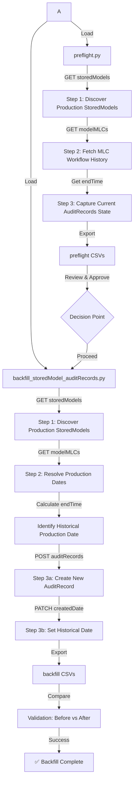

# ModelOp AuditRecords Backfill Solution

### ***Secure, validated approach to retroactively assign production dates to StoredModel audit records after the 3.4 upgrade.***

---

## Overview

This is a production-ready Python solution for backfilling StoredModel AuditRecords, model stages, and model business drivers in ModelOp Center 3.4.

### The Problem

When upgrading to ModelOp Center 3.4, AuditRecords for StoredModels that were promoted to production *before* the upgrade don't exist. Without these records, your governance dashboard and audit trails are incomplete for those models.  Additionally, any StoredModel records that do not have values set for modelStage and primaryDriver will not appear on the Use Case dashboard which results in misleading charts and counts.

### The Solution

This toolkit provides:

- **`preflight.py`** — Non-destructive validation capturing the current state before any modifications
- **`backfill_storedModel_auditRecords.py`** — Actual backfill using historical MLC workflow end times as production promotion dates
- **Comprehensive CSV exports** — Enable before/after comparison and audit trail

### Key Innovation

**Use MLC workflow `processInstance.endTime` as the source of truth for historical production dates.** This script resolves when models were actually promoted to production by examining the Model Lifecycle workflow execution history, then backfills AuditRecords with those historical dates.

---

##  Visual Architecture



---

##  Repository Structure

```
backfill_auditRecords/
├── requirements.txt                          # Python dependencies
│
├── preflight.py                              # Step 1-4: Non-destructive preflight
├── backfill_storedModel_auditRecords.py      # Step 2-4: Actual backfill (POST/PATCH)
│
└── Generated Outputs (after running scripts)
    ├── preflight_storedmodels.csv            # Production StoredModels snapshot
    ├── preflight_mlcs.csv                    # MLC workflow execution history
    ├── preflight_auditrecords_before.csv     # AuditRecords state BEFORE backfill
    ├── production_storedmodels_from_search.csv
    ├── mlc_resolved_production_dates.csv
    └── auditrecord_backfill_results.csv      # New AuditRecords AFTER backfill
```

---

##  Configuration & Setup

### Prerequisites

- Python 3.7+
- Access to ModelOp Center 3.4 API
- Bearer/Access token

### Environment Variables

```plaintext
MOC_BASE_URL=https://your-instance.modelop.center
MOC_ACCESS_TOKEN=<cached-oauth2-token>
PRODUCTION_MODEL_STAGE_VALUE=prod
```

```

**Verification**: Open VS Code terminal and run `echo $MOC_BASE_URL` — it should print your configured URL.

---

##  Installation

### 1. Install Python Dependencies

```bash
pip install -r requirements.txt
```

This installs:
- **requests** ≥ 2.28.0 — HTTP client for API calls
- **pandas** ≥ 1.5.0 — DataFrame and CSV handling
- **python-dotenv** ≥ 0.21.0 — Environment variable management

### First Run Setup

```bash
python preflight.py
```

---

##  Usage & Execution Phases

### Phase 1: Preflight Validation (Non-Destructive)

The preflight script performs **GET-only** operations to capture the current state before any modifications.

```bash
python preflight.py
```

**What it does**:
- Authenticates to ModelOp Center
- Discovers all production StoredModels via `GET /api/storedModels/search/findProductionUseCases`
- Fetches MLC workflow history via `GET /api/modelMLCs/search/findAllByStoredModelIdAndGroupIn` for each model
- Captures current AuditRecords state via `GET /model-manage/api/auditRecords/search/findAuditRecordsByStoredModelId`
- Exports three CSV files for review

**Risk Level**: 🟢 **None** — Only GET requests, no data modifications

**Time**: 2–5 minutes (depends on number of StoredModels)

**Output Files**:

| File | Purpose | Key Columns |
|------|---------|-------------|
| `preflight_storedmodels.csv` | Production StoredModels snapshot | storedModelId, storedModelName, modelStage, createdDate, lastModifiedDate |
| `preflight_mlcs.csv` | MLC workflow execution history | storedModelId, mlcId, processDefinitionName, processEndTime (key for production date!) |
| `preflight_auditrecords_before.csv` | **CRITICAL** — Current AuditRecords state BEFORE backfill | storedModelId, auditRecordId, auditRecordCreatedDate, recordExists (boolean) |

**Next Step**: Review the CSV files to verify correct StoredModels and understand current state, then proceed to Phase 3.

---

### Phase 2: Decision Point

Before running the destructive backfill, verify:

- [ ] All three preflight CSV files generated successfully
- [ ] `preflight_storedmodels.csv` contains your target StoredModels
- [ ] `preflight_mlcs.csv` shows workflow history with populated `processEndTime` values
- [ ] `preflight_auditrecords_before.csv` shows which StoredModels already have (or don't have) AuditRecords

**If issues found**: Troubleshoot and run preflight again before proceeding.

---

### Phase 3: Actual Backfill (Destructive)

Once you've reviewed the preflight results and are ready, run the actual backfill:

```bash
python backfill_storedModel_auditRecords.py
```

**What it does**:
- Authenticates to ModelOp Center
- Discovers StoredModels
- **Updates unset primaryDriver and modelStage** on each Use Case
- **Resolves historical production dates** from MLC workflow `processInstance.endTime` values
- **Creates new AuditRecords** via `POST /model-manage/api/auditRecords` ⚠️ **DESTRUCTIVE**
- **Patches createdDate** via `PATCH /model-manage/api/auditRecords/{id}` to set historical dates ⚠️ **DESTRUCTIVE**
- Exports results CSV for comparison

**Risk Level**: 🟡 **Medium** — POST and PATCH operations modify your ModelOp Center data

**Time**: 5–15 minutes (depends on number of StoredModels)

**Output Files**:

| File | Purpose |
|------|---------|
| `production_storedmodels_from_search.csv` | StoredModels discovered during backfill run |
| `mlc_resolved_production_dates.csv` | Resolved production dates from MLC workflows |
| `auditrecord_backfill_results.csv` | New AuditRecords created with historical dates |

---

### Phase 4: Validation & Comparison

Compare the before and after states:

```bash
# Windows
fc /U preflight_auditrecords_before.csv auditrecord_backfill_results.csv

# Mac/Linux
diff -u preflight_auditrecords_before.csv auditrecord_backfill_results.csv
```

**Spot-check in ModelOp Center UI**:
1. Log into ModelOp Center 3.4
2. Navigate to one of the backfilled StoredModels
3. Check the **Audit** section
4. Verify:
   - New AuditRecord entry exists
   - `createdDate` is set to historical production date (from MLC workflow `processEndTime`)
   - Changes show `modelStage` change to "Production"

**Expected Results**:
- ✅ New AuditRecord IDs created for models that didn't have them
- ✅ `recordExists` changed from `FALSE` to `TRUE` for newly created records
- ✅ `auditRecordCreatedDate` matches historical production date from MLC workflow

---

##  Troubleshooting Guide

### Authentication Issues


**Error**: `401 Unauthorized` or `Failed to authenticate`
```bash
# Check your bearer token/access token and environment URL
python preflight.py
# Enter credentials when prompted
```

### API Connection Issues

**Error**: `Connection timeout` or `HTTPConnectionPool`
- Verify network connectivity to ModelOp Center instance
- Check base URL is correct
- Verify firewall/proxy settings aren't blocking API calls
- Test connectivity: `ping your-instance.modelop.center`

**Error**: `404 Not Found` on endpoints
- Verify endpoint paths are correct for your environment
- Confirm `/api/storedModels/search/findProductionUseCases` exists in your version
- Check API documentation for available endpoints

---

### Data & Script Issues

**Error**: `No production StoredModels discovered`
- Verify StoredModels exist and are in production stage
- Check `PRODUCTION_MODEL_STAGE_VALUE` (default: `prod`)
- Run preflight with debug logging for details

**Error**: `preflight_mlcs.csv is empty`
- Not all StoredModels have MLC workflow histories (normal)
- Script falls back to `StoredModel.createdDate` if no MLC found
- Check `preflight_storedmodels.csv` to verify models were discovered

**Error**: CSV files are empty or minimal
- Check script logs for error messages

---

### Windows-Specific Issues

**Error**: `'python' is not recognized as an internal or external command`
```bash
# Use python3 or full path to Python executable
python3 preflight.py
# Or:
C:\Python310\python.exe preflight.py
```

**Error**: File comparison doesn't work
```bash
# Use Python's built-in diff instead of fc
python -m difflib preflight_auditrecords_before.csv auditrecord_backfill_results.csv
```

---

##  Additional Resources

| Resource | Description | Link |
|----------|-------------|------|
| **Engineering Guide** | Official ModelOp process for backfilling AuditRecords before 3.4 upgrade | [Backfilling StoredModel AuditRecords Before ModelOp Center 3.4 Upgrade](https://modelop.atlassian.net/wiki/x/BIBbvQ) |
| **ModelOp API Docs** | Complete API reference for your instance | Contact your ModelOp administrator |
| **Python Requests** | HTTP client library documentation | [requests.readthedocs.io](https://requests.readthedocs.io/) |
| **Pandas DataFrames** | CSV and data processing documentation | [pandas.pydata.org](https://pandas.pydata.org/) |
| **python-dotenv** | Environment variable management | [github.com/theskumar/python-dotenv](https://github.com/theskumar/python-dotenv) |
| **VS Code Python Settings** | Comprehensive Python extension configuration reference | [code.visualstudio.com/docs/python/settings-reference](https://code.visualstudio.com/docs/python/settings-reference) |

---

## Quick Reference

### Common Commands

```bash
# First time setup
pip install -r requirements.txt
python preflight.py

# Capture current state
python preflight.py

# Execute backfill (after approval)
python backfill_storedModel_auditRecords.py

# Reset credentials (force re-authentication)
rm .env
python preflight.py
```

### CSV Column Guide

**preflight_auditrecords_before.csv**:
- `storedModelId` — StoredModel UUID
- `auditRecordId` — Existing AuditRecord UUID (NULL if none)
- `auditRecordCreatedDate` — When the AuditRecord was created
- `recordExists` — TRUE/FALSE whether AuditRecord currently exists

**auditrecord_backfill_results.csv**:
- `storedModelId` — StoredModel UUID
- `resolvedProductionDate` — Historical production date from MLC workflow
- `newAuditRecordId` — Newly created AuditRecord UUID
- `newAuditRecordCreatedDate` — Creation date (set to resolvedProductionDate)

---

## Security Best Practices

✅ **Implemented in this toolkit**:
- OAuth2 token cached locally for reuse
- HTTPS for all API calls

⚠️ **Additional recommendations**:
- Use service accounts for automated deployments
- Rotate credentials periodically
- Consider AWS Secrets Manager or HashiCorp Vault for production environments

---

## Support & Debugging

**For detailed debugging**, enable Python logging:

1. Edit the script to set logging level to DEBUG:
   ```python
   logging.basicConfig(level=logging.DEBUG)
   ```

2. Run the script and capture full logs:
   ```bash
   python preflight.py > debug_preflight.log 2>&1
   ```

3. Review the detailed logs for specific error information

**For script issues**:
1. Review generated CSV files to understand current state
2. Check the detailed logs (enable DEBUG logging above)
3. Verify API endpoints are accessible and correct
4. Ensure your credentials are valid

## Implementation Details

### What Gets Backfilled

For each production StoredModel:

1. **Discovers** via `GET /api/storedModels/search/findProductionUseCases`
2. **Updates** empty modelStage and primaryDriver values to 'unassigned'
3. **Resolves production date** from `GET /api/modelMLCs` → takes latest `processInstance.endTime`
4. **Creates AuditRecord** via `POST /model-manage/api/auditRecords`
   **Patches createdDate** via `PATCH /model-manage/api/auditRecords/{id}` to historical date

### Fallback Logic

- If no MLC workflows found, uses `StoredModel.lastModifiedDate` as production date
- If AuditRecord creation fails, logs error and continues with next model
- If PATCH fails, logs error but doesn't retry previous records

---

## Files & Configuration

### Included Files

| File | Purpose |
|------|---------|
| `preflight.py` | Non-destructive GET-only validation script |
| `backfill_storedModel_auditRecords.py` | Destructive POST/PATCH backfill script |
| `requirements.txt` | Python package dependencies |
| `.vscode/settings.json` | VS Code integrated terminal configuration |

### Auto-Generated Files

After running scripts, you'll have:

```
preflight_storedmodels.csv              # StoredModels snapshot
preflight_mlcs.csv                      # MLC history from preflight
preflight_auditrecords_before.csv       # AuditRecords BEFORE backfill
production_storedmodels_from_search.csv # StoredModels from backfill run
mlc_resolved_production_dates.csv       # Resolved production dates
auditrecord_backfill_results.csv        # Results AFTER backfill
.env                                     # Credentials & cached token (git-ignored)
```

---

## Success Checklist

Before executing backfill:

- [ ] Python dependencies installed (`pip install -r requirements.txt`)
- [ ] VS Code `.vscode/settings.json` configured
- [ ] Preflight run successful with three CSV exports
- [ ] Reviewed and approved preflight results
- [ ] Network connectivity to ModelOp Center verified

After backfill completion:

- [ ] All three CSV files generated
- [ ] `auditrecord_backfill_results.csv` shows expected number of new records
- [ ] Before/after comparison shows desired changes
- [ ] Spot-check in ModelOp Center UI confirms AuditRecords exist with correct dates
- [ ] Results archived for audit trail

---

**Last Updated**: March 12, 2026  
**Version**: 1.0 — Production Ready  